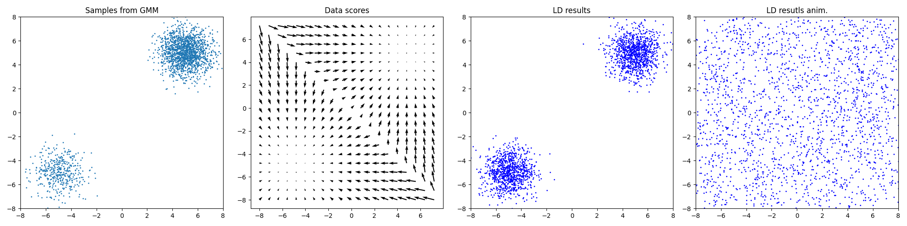
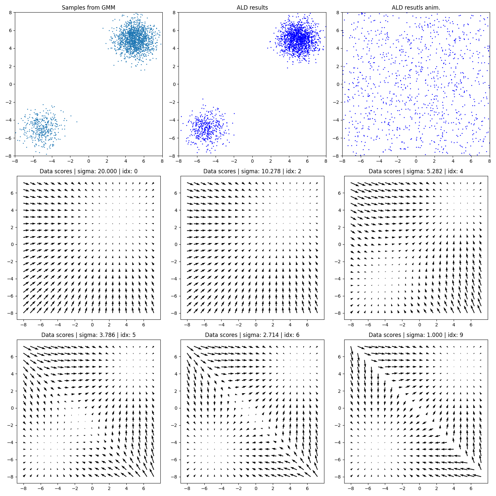
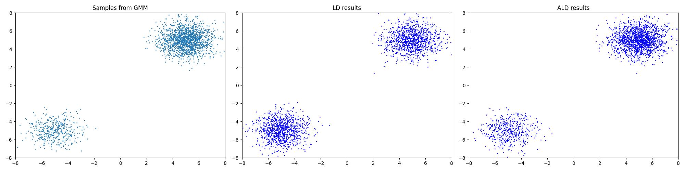

# scorenet
Reproduction of Generative Modeling by Estimating Gradients of the Data Distribution

## Intro
I reproduced the code of the toy problem in the paper "Generative Modeling by Estimating Gradients of the Data Distribution".  
I refer to the original code. [Original code](https://github.com/ermongroup/ncsn)

I will extend it by applying it to MNIST data.

## Install
```
source scripts/install.sh
```

## Results
### Results of basic langevin dynamics in animation.



### Results of anneal langevin dynamics in animation.
I visualized the data scores according to the sigma.  



### Comparision langevin dynamics and anneal langevin dynamics


